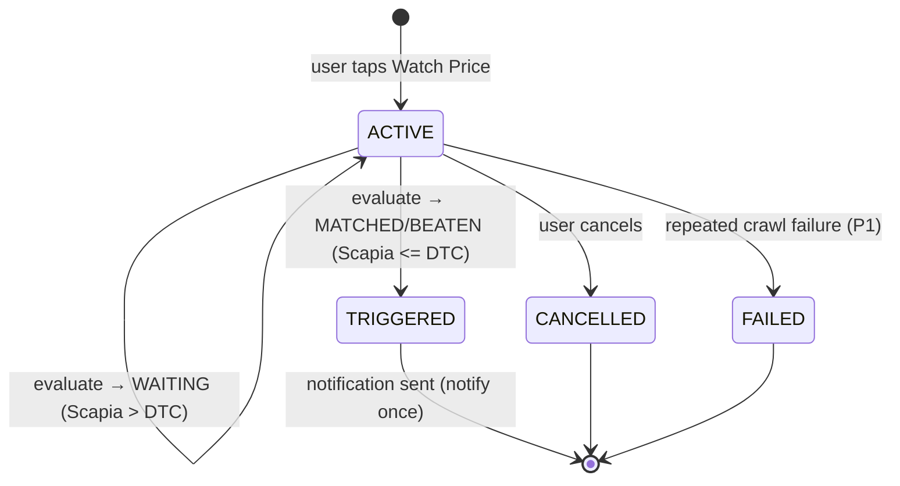
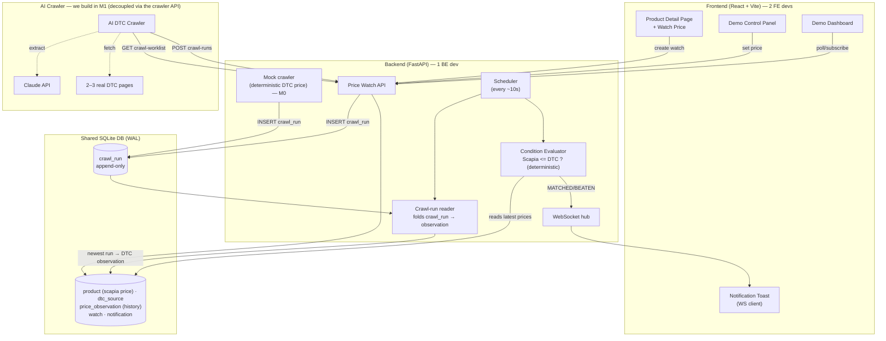
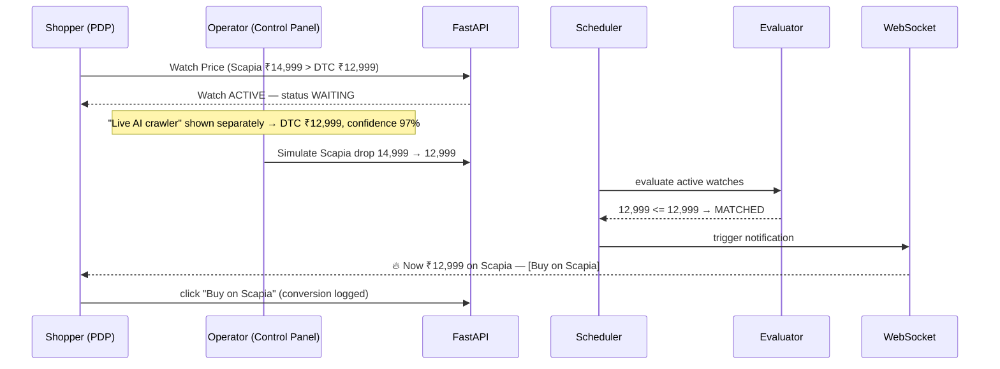

# Scapia Price Watch — Requirements & Scope (Hackathon POC)

> **Status:** Draft for team sign-off · **Time budget:** 6 hours · **Team:** 1 Backend + 2 Frontend

---

## 1. The one-line problem

> Customers sometimes find the same product cheaper on the brand's own (DTC) website.
> If Scapia can't match that price *today*, we risk losing the purchase entirely.

**Our answer:** don't lose the customer — let them **watch the price**. We monitor the DTC
price (benchmark) and our own Scapia price (destination), and when
`ScapiaPrice <= DtcPrice`, we bring them back to buy **on Scapia**.

```
DTC website = PRICE BENCHMARK (never the purchase destination)
Scapia      = ALWAYS the PURCHASE DESTINATION
```

---

## 2. What "done" looks like (success criteria)

A judge understands the whole product in **under 30 seconds** by watching this run live:

```
Browse product on Scapia (Scapia is pricier today)
        → tap "Watch Price"
        → system monitors DTC price + Scapia price
        → Scapia price drops to <= DTC
        → real-time notification: "Now matching the brand price — Buy on Scapia"
        → user buys on Scapia
```

The demo **must not break** if the internet is slow, a DTC site is down, or the LLM API
fails. The price-match flow runs entirely on local/mock data; the live AI crawler is shown
as a *separate* capability.

---

## 3. Scope — IN vs OUT

### ✅ IN SCOPE

| # | Capability | Priority | Owner |
|---|-----------|----------|-------|
| 1 | Mock product catalogue (3–5 products, seeded) | P0 | FE |
| 2 | Product Detail Page: Scapia price, DTC benchmark, "Watch Price" | P0 | FE |
| 3 | Create / cancel a Price Watch (API + persistence) | P0 | BE |
| 4 | Deterministic **condition evaluator** (`Scapia <= DTC`), unit-tested | P0 | BE |
| 5 | Background **scheduler** re-evaluating active watches every N seconds | P0 | BE |
| 6 | **Demo control panel**: change Scapia price / change DTC price on demand | P0 | BE + FE |
| 7 | **Real-time notification** over WebSocket → toast + "Buy on Scapia" CTA | P0 | BE + FE |
| 8 | **Demo dashboard**: active watches, triggered watches, latest observations | P0 | FE |
| 9 | **DTC crawler contract** + **mock crawler**: crawler HTTP API + `crawl_run` shape; mock feeds deterministic DTC prices | P0 | BE |
| 10 | **AI DTC crawler** (built in M1): fetch DTC page → Claude extracts price → INSERT into `crawl_run` | P1 | BE |
| 11 | **Crawl-result reader**: backend folds `crawl_run` into DTC observations | P1 | BE |
| 12 | **Crawler result UI** — show the extraction result (price + confidence) | P1 | FE |
| 13 | **Price history** chart (from stored observations) | P1 | FE |

### ❌ OUT OF SCOPE (explicit non-goals)

- Real checkout / payment / cart
- Auth / accounts — handled by an **existing real service**; backend just accepts a `userId`
- Postgres / Kafka / any distributed infra (SQLite file is enough)
- Autonomous, self-healing crawler framework that works on *any* site (we build it for **2–3
  DTC sites** only; the crawler stays decoupled behind the `crawl_run` contract)
- Hundreds of brands (real crawler onboards **2–3 DTC sites**, TBD; rest are mocked)
- Product / variant / size / colour matching (identity is **manually mapped**)
- ML price prediction / arbitrage detection
- Generic price-comparison shopping engine
- Real push notifications (WebSocket only)

> **Note:** the AI crawler **is** built in this hackathon — in **M1**, after the M0 spine is
> demoable. It is kept decoupled behind the `crawl_run` contract so M0 never depends on it.
>
> **Hard rule:** do not touch P1/M1 until the P0/M0 spine works end-to-end. P2 (extra brands,
> variant matching, self-healing crawler) only if there's time to spare.

---

## 4. Roles

| Persona | In the demo | Notes |
|---------|-------------|-------|
| **Shopper** | Browses a product, taps Watch Price, gets notified, buys on Scapia | Identified by a `userId`; auth is handled by an existing real service (out of scope) |
| **Demo operator** (us) | Drives the demo control panel to change prices and trigger the match | The "god mode" panel is presenter-only |

---

## 5. Functional requirements

**FR-1 Catalogue (mock).** FE serves 3–5 products, each with: name, image, `scapiaPrice`,
`dtcUrl`, `dtcSource`, and a benchmark `dtcPrice`. Catalogue is frontend-mocked so we only
crawl a couple of real DTC pages.

**FR-2 Watch creation.** From the PDP, the shopper can enable a Price Watch for a product.
Creates a `Watch` with status `ACTIVE`. Current prices are **read from the observation log**,
not snapshotted onto the watch (they'd drift); only the prices *at trigger time* are later
frozen onto the watch for the notification.

**FR-3 Price observation.** Every price change (Scapia or DTC) is appended to the
`PriceObservation` history (productId, dtcSourceId?, price, origin, timestamp) — this feeds the
price-history chart. `kind` is derived (`dtcSourceId` NULL ⇒ SCAPIA, else DTC). Current prices
are read from `product.scapiaPrice` and the `dtcSource.latestPrice` cache (kept in step with
the history).

**FR-4 Condition evaluator (deterministic).**
```
if ScapiaPrice >  DtcPrice → WAITING   (watch stays ACTIVE)
if ScapiaPrice == DtcPrice → MATCHED   (trigger)
if ScapiaPrice <  DtcPrice → BEATEN     (trigger)
```
Both current prices are re-read every cycle — the DTC price is **dynamic**, never a frozen
target. Pure function, unit-tested, **no LLM involved**.

**FR-5 Scheduler.** A background job re-evaluates every `ACTIVE` watch on a short interval
(default **10s**, configurable). On MATCHED/BEATEN → create notification, set watch
`TRIGGERED`. **Notify once** — a `TRIGGERED` watch is never re-evaluated.

**FR-6 Notification.** On trigger, push a message over WebSocket to the shopper UI: product,
Scapia price, DTC price, savings (if beaten), and a **"Buy on Scapia"** CTA. Clicking the CTA
is logged as the conversion event.

**FR-7 Demo controls.** Operator can set the Scapia and/or DTC price for any product. A Scapia
change updates `product.scapiaPrice` and logs an `INTERNAL` observation; a DTC change INSERTs a
mock `CrawlRun` — the **same path the real crawler uses** — which the backend folds into a DTC
observation. Either flows through the evaluator on the next tick (≤10s) or via "force evaluate
now" for an instant demo trigger.

**FR-8 Dashboard.** Live view of: active-watch count, triggered count, DTC-source count, and
a table of watched products with current Scapia vs DTC prices and a ✓ when matched/beaten.

**FR-9 DTC price source contract (BE owns).** The AI crawler is **built by our team in M1**,
but kept behind a hard contract so M0 can be built and demoed without it. The backend defines
and owns the **contract** on both sides:

- **Read — `GET /api/internal/crawl-worklist`** → `[{ dtcSourceId, label, url }]`,
  **demand-driven — only sources that have an `ACTIVE` watch**, so unwatched products are never
  crawled (the backend computes the join; the crawler needn't know it).
- **Write — `POST /api/internal/crawl-runs`** with one result per source:
  `{ dtcSourceId, status ∈ {OK,DEGRADED,FAILED}, price?, productName?, confidence?, error?,
  crawledAt? }` → `201` with the created run.

**Integration = HTTP (the crawler API).** The crawler talks only to those two endpoints — it
**never touches the DB**. The backend persists each POST as an append-only `crawl_run` row, and
its reader folds the newest un-ingested run per `dtcSourceId` into a `PriceObservation` and
refreshes `dtcSource.latestPrice`. Business logic **never parses free-form LLM text** — it
consumes the structured `crawl_run` schema. Confidence/status describe the *crawl*, not the price.

Two implementations satisfy the same contract:
1. **Mock crawler (M0 / P0, demo-safe):** deterministic DTC prices, driven by the demo
   control panel; produces the same `crawl_run` shape in-process. This is what the live demo relies on.
2. **Real AI crawler (M1 / P1, built by us):** fetches the DTC page, uses Claude to extract a
   structured price, and POSTs results to `/api/internal/crawl-runs`. If it is down, slow, or
   reports `FAILED`, the watch keeps its last known DTC price — the M0 flow never breaks.

**FR-10 Crawl-run folding (M1 / P1).** Backend reads new `crawl_run` rows each scheduler tick,
folds OK/DEGRADED runs into a DTC `PriceObservation` (origin `AI_CRAWL`, linked by `crawlRunId`),
stamps `ingestedAt`, and is idempotent per `crawl_run.id` so re-reads don't double-write.

---

## 6. Non-functional / demo-safety requirements

- **NFR-1 Determinism.** The core match decision is a pure, testable function. AI is *only*
  extraction intelligence, never the notify decision.
- **NFR-2 Demo Mode.** Everything runs on local mock/seeded data with no external dependency.
  Live crawler is opt-in and isolated.
- **NFR-3 Speed.** From "simulate price drop" to notification ≤ one scheduler tick (~10s);
  offer a "force evaluate now" for an instant on-stage trigger.
- **NFR-4 Resilience.** DTC site down / LLM down / slow network must not break the P0 flow.
- **NFR-5 Legibility.** Every stage of the pipeline is visible on screen (observation →
  evaluation → trigger → notification) so a judge can follow it.

---

## 7. Core entities (kept deliberately small)

Two design lines: **the Scapia price is internal** — a field on `product`; **the DTC price is
external/scraped** — on `dtc_source`, written only via `crawl_run`. `price_observation` keeps an
append-only history of both, for the chart. Canonical DDL: `backend/schema.sql`.

```
Product        catalogue + internal Scapia price — id, name, imageUrl, scapiaPrice
               (the Scapia buy link is DERIVED from id, not stored)

DtcSource      one product's DTC listing = the product→crawl mapping — id, productId,
               label, url, latestPrice + latestObservedAt (read-cache of the last folded crawl)

CrawlRun       ⭐ the crawler's ONLY write target (an extraction event, not a price) — id,
               dtcSourceId, status ∈ { OK, DEGRADED, FAILED }, price?, productName?,
               confidence?, error?, crawledAt, ingestedAt?
               → an OK/DEGRADED run is folded into a DTC price; FAILED is a no-op

PriceObservation   append-only price history (feeds the chart) — id, productId,
                   dtcSourceId? (NULL ⇒ SCAPIA, set ⇒ DTC), price, observedAt,
                   origin ∈ { INTERNAL, AI_CRAWL }, crawlRunId?

Watch          id, userId, productId, status ∈ { ACTIVE, TRIGGERED, CANCELLED, FAILED },
               lastResult ∈ { WAITING, MATCHED, BEATEN },
               triggeredScapiaPrice?, triggeredDtcPrice?   (frozen snapshot at trigger)
               createdAt, updatedAt, lastEvaluatedAt, triggeredAt

Notification   immutable record — id, watchId, userId, kind ∈ { MATCHED, BEATEN },
               scapiaPrice, dtcPrice, savings, buyUrl,
               createdAt, deliveredAt?, buyClickedAt?   (drives the conversion funnel)
```

> **Current prices:** Scapia = `product.scapiaPrice`; DTC = `dtcSource.latestPrice` (a cache
> kept in step with the observation log). The evaluator reads exactly these two numbers.
> **No `condition` column** — the single rule (`Scapia <= DTC`) lives in `evaluator.py`.

### Watch state machine



---

## 8. System context (HLD sketch)



---

## 9. The demo script (what we rehearse)



---

## 10. Tech stack (proposed)

| Layer | Choice | Why |
|-------|--------|-----|
| Backend | **Python + FastAPI** | Async, native WebSockets, fast to write, one language for API + crawler + AI |
| Persistence | **SQLite** (via SQLModel) | Zero infra, file-based, demo-safe, real repos + price history |
| Scheduler | **APScheduler** / asyncio task | Simple interval job, no Kafka |
| Crawler | **Built by us in M1**, decoupled via `crawl_run` | httpx/Playwright fetch → Claude extract → INSERT; M0 uses a mock behind the same contract |
| AI | **Claude (Anthropic SDK)** | Used inside our M1 crawler for structured JSON extraction |
| Frontend | **React + Vite + Tailwind** | Lightweight SPA, fast HMR, 2 devs in parallel |
| Realtime | **WebSocket** | The "wow" moment; no push infra |

---

## 11. Proposed 6-hour ownership split

- **Backend (you):** M0 — FastAPI skeleton + SQLite models → watch CRUD + observations →
  evaluator (+ unit tests) → scheduler → WebSocket hub → demo-control endpoints → **mock
  crawler + crawl-result contract**. M1 — **build the AI crawler** (fetch → Claude → INSERT)
  + the crawl-result reader.
- **FE-1:** Product Detail Page + Watch Price flow + WebSocket notification toast + "Buy on Scapia".
- **FE-2:** Demo dashboard + demo control panel + *(P1)* price-history chart + crawler-result UI.
- **Shared contract:** agree the REST + WS JSON shapes in the **first 30 min** so FE can mock
  against them and BE can build behind them independently.

---

## 12. Assumptions & open questions (please confirm)

All decisions below are **confirmed** — no open blockers:

1. ✅ **Persistence = SQLite + SQLModel**, WAL mode (backend owns all DB writes).
2. ✅ **AI = Claude**, used inside our M1 crawler.
3. ✅ **Crawler = built by us in M1**, decoupled via the `crawl_run` contract; a mock crawler covers M0.
4. ✅ **Integration = HTTP crawler API** — `GET /api/internal/crawl-worklist`, `POST /api/internal/crawl-runs`; backend owns DB writes.
5. ✅ **Scheduler = 10s tick + "force evaluate now"** button.
6. ✅ **Auth = existing real service** (out of scope); backend accepts a `userId`.
7. ⏳ **Which 2–3 real DTC sites** our M1 crawler targets — deferred; contract + mock are
   site-agnostic, so this does not block M0. Needed only when M1 starts (pick sites early
   enough to know if any are JS-rendered and need Playwright vs plain httpx).

### Delivery strategy (milestones)

> **M0 — get a demoable product first.** Full BE + FE spine running on the **mock** DTC price
> source: catalogue → PDP → Watch → evaluator → scheduler → WebSocket notify → dashboard +
> demo controls. No dependency on the external crawler. **This alone is a complete demo.**
>
> **M1 — build & plug in the AI crawler.** Only after M0 works end-to-end: we build the crawler
> (`GET /api/internal/crawl-worklist` → fetch DTC page → Claude extract → `POST /api/internal/crawl-runs`);
> the backend folds the results; crawler-result UI + price-history chart light up. If M1 slips,
> the demo still stands on M0.
